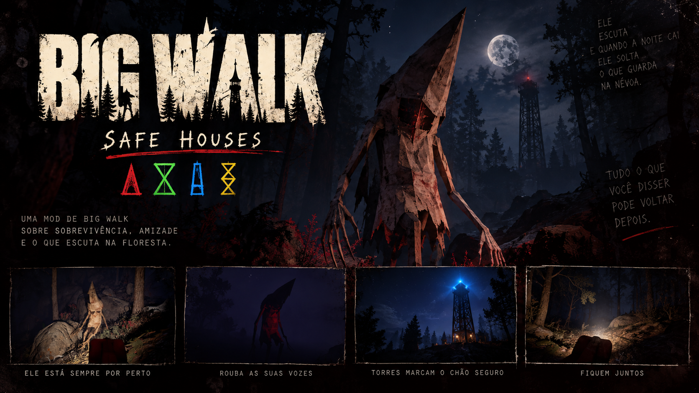

  

<h1 align="center">Big Walk: Safe Houses</h1>

  <b>A co-op horror mod for Big Walk.</b> 
  <i>Survival, friendship and whatever is listening in the woods.</i>

  <a href="https://github.com/MarceloJDCB/BigWalkSafeHouses/releases/latest/download/BigWalkSafeHouses-instalador.zip"><b>⬇ Download the installer</b></a>
  &nbsp;·&nbsp;
  <a href="https://github.com/MarceloJDCB/BigWalkSafeHouses/releases">All versions</a>
  &nbsp;·&nbsp;
  <a href="README.md">Português</a>

---

> *It listens. And when night falls, it lets loose what it keeps in the fog.*

By day, the walk feels normal. A figure at the corner of your eye. Footsteps behind you that stop when you turn. Something moving through the brush, while the whole group is right beside you.

At night, **the Devil** releases **the Demon**: a hunched figure with a pointed hood and a red slit where the face should be. It has no voice of its own. That is why it steals yours.

## Installation

**Everyone in the lobby must install it.**

1. Download the [**installer**](https://github.com/MarceloJDCB/BigWalkSafeHouses/releases/latest/download/BigWalkSafeHouses-instalador.zip) and extract it anywhere.
2. Close Big Walk and double-click **`INSTALAR.bat`**. It finds the game on Steam and downloads BepInEx if missing.
3. Launch the game. The first start takes 1–2 minutes with a black console window; that is normal.

> If Windows shows *"Windows protected your PC"*, click **More info → Run anyway**.
> To remove the mod, use **`DESINSTALAR.bat`**.

### Automatic updates

The mod updates itself every time you open the game. In the lobby, the host checks that everyone is on the same version and warns whoever is not.

## How to survive

| | |
|---|---|
| 🌞 **Day** | Only strange things: figures, footsteps, rustling bushes, a familiar voice calling. |
| 🌑 **Night** | The Demon hunts. Before it arrives, the brush moves, footsteps close in and the beacon flickers. |
| 🗼 **Towers** | The only safe ground. Inside, it cannot get you... but it circles outside. |
| 🟢 **Checkpoint** | Reaching a tower makes it the group's checkpoint. The next one unlocks only after you seat the gourd in the current one. |
| ❤️ **Lives** | 3 per player. Lost them all? You go back **alone** to the last checkpoint. |

## The three monsters

Only one is on stage at a time, and each needs a different defence. The **Director** decides: it follows a rhythm of build-up, peak and relief, calls the monster that fits the moment (someone isolated, the group split, or the group together) and gets tougher as you progress through towers and nights. After an attack there is always real breathing room.

> When in doubt, press **J**: the **field journal** shows each monster and how to defend yourself. It also opens from the main menu.

- **Stalker:** the hooded one described above. Hunts at night, hiding behind trees and rocks. A flashlight in its face scares it off, but it learns. Looking at it is not enough: it veers off and **keeps coming**.
- **Whisperer:** moves only while **nobody** is looking at it. If **anyone** in the group stares, it freezes. Take turns watching and never turn your back on where it was seen.
- **Mimic:** becomes **a member of your group**, copies how they move and calls with their **voice**. The voice never travels over the network: each player only hears what their own PC already recorded.
  - **Tells:** no footstep sounds, and it never carries an item.
  - **How to expose it:** shine a flashlight on it for 2 seconds, or have the real player speak while the copy is in sight.

### Last life

When a monster catches you on your **last life**, it **decapitates** you in a long scene. On other lives it is just the grab, with dark blood.

## 🔫 Weapon mode (Fun Mod)

Optional. Whoever creates the match turns on **Weapon mode**, right below the player count.

- **One** double-barrel shotgun per match. It lies at the spawn-yard exit, where a torch would be.
- **2 shells in every safe house.** Only the player holding the gun can pick them up; the gun holds 2.
- A shot scares the monsters away and silences everything for a while... **but they come back angrier**.
- **Friendly fire is on.** And throwing the loaded gun may fire it, even at you.

Without Weapon mode, the game is pure horror, as always.

## 🗣️ It hears you

Talking loudly draws the Demon. And what you say may **come back later, from among the trees**, in a friend's voice calling you.

Don't go there.

> **Privacy:** phrases are kept only in memory during the match. **Nothing is written to disk** and nothing leaves your session.

## Language

The mod follows your Steam language for Big Walk: **Portuguese** or **English**. To force one, set `Idioma = pt` or `en` in `BepInEx\config\SafeHouses.Loader.cfg`.

## Problems?

Send the file `Big Walk\BepInEx\LogOutput.log`, yours and the host's.

---

  
    Unofficial fan mod, not affiliated with the developers of Big Walk. 
    Uses <a href="https://github.com/BepInEx/BepInEx">BepInEx</a> (LGPL-2.1), downloaded from
    <a href="https://thunderstore.io/c/big-walk/p/BepInEx/BepInExPack_IL2CPP/">Thunderstore</a> by the installer.
  

<i>Will you finish the walk together?</i>

